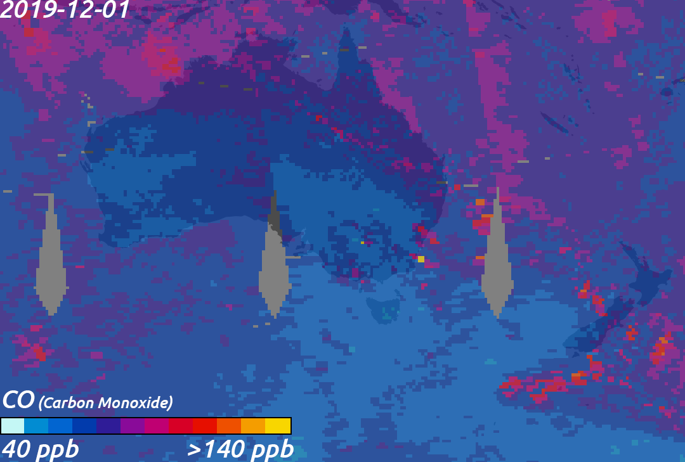

```{r setup, include=FALSE}
knitr::opts_chunk$set(echo = TRUE,
                      collapse = TRUE,
                      message = FALSE,
                      warning = FALSE,
                      error = FALSE)
```
## Australian Bushfire App

With this app you can visualize and analyze the spatial temporal variation of Australian Bushfire Season (2019-2020) and get an instant feedback about the impact and the spread of the fires.

### Australian Bushfire Season

#### Overview

From September 2019 to March 2020, fires heavily impacted various regions of the state of New South Wales. In eastern and north-eastern Victoria large areas of forest burnt out of control for four weeks before the fires emerged from the forests in late December. Multiple states of emergency were declared across New South Wales, Victoria, and the Australian Capital Territory. Reinforcements from all over Australia were called in to assist fighting the fires and relieve exhausted local crews in New South Wales. The Australian Defence Force was mobilised to provide air support to the firefighting effort and to provide manpower and logistical support. Firefighters, supplies and equipment from Canada, New Zealand, Singapore and the United States, among others, helped fight the fires, especially in New South Wales.

#### Environmental effects

In mid-December 2019, a NASA analysis revealed that since 1 August, the New South Wales and Queensland bushfires had emitted 250 million tonnes (280 million short tons) of carbon dioxide (CO2). As of 2 January 2020, NASA estimated that 306 million tonnes (337 million short tons) of CO2 had been emitted. By comparison, in 2018, Australia's total carbon emissions were equivalent to 535 million tonnes (590 million short tons) of CO2. While the carbon emitted by the fires would normally be reabsorbed by forest regrowth, this would take decades and might not happen at all if prolonged drought has damaged the ability of forests to fully regrow.
CO emitted by 2019–20 south-east bushfire captured by NASA Aqua AIRS instrument.

<div align="center">

</div>


The local impacts of the Australian bushfires have been devastating to property and life in Australia while producing extreme air quality impacts throughout the region. As smoke from the massive fires has interacted with the global weather, the transport of smoke plumes around the global have accelerated through deep vertical transport into the upper troposphere and even the lowermost stratosphere, leading to [long-range transport around the globe](<https://gmao.gsfc.nasa.gov/research/science_snapshots/2020/Australia_fires_smoke.php?utm_source=TWITTER&utm_medium=NASA_NCCS&utm_campaign=NASASocial&linkId=80822832>). 
The smoke from these bushfires will travel across the Southern Ocean completing a global circumnavigation back around to Australia and is particularly pronounced across the southern Pacific Ocean out to South America.

<div align="center">
<iframe width="800" height="500" src="https://www.youtube.com/embed/uKfPbgPk1-0" frameborder="0" allow="accelerometer; autoplay; clipboard-write; encrypted-media; gyroscope; picture-in-picture" allowfullscreen></iframe>
</div>


#### Ecological effects

The Australian Academy of Science from the University of Sydney, estimated on 8 January 2020 that more than one billion animals were killed by bushfires in Australia; while more than 800 million animals perished in New South Wales. The estimate was based on a 2007 World Wide Fund for Nature (WWF) report on impacts of land clearing on Australian wildlife in New South Wales that provided estimates of mammal, bird and reptile population density in the region. Dickman's calculation had been based on highly conservative estimates and the actual mortality would therefore be higher. The figure provided by Dickman included mammals (excluding bats), birds, and reptiles; and did not include frogs, insects, or other invertebrates. Other estimates, which include animals like bats, amphibians and invertebrates, also put the number killed at over a billion.

A 2020 study estimated that at least 3 billion terrestrial vertebrates alone were displaced or killed by the fires, with reptiles (which tend to have higher population densities in affected areas compared to other vertebrates) comprising over two-thirds of the affected, with birds, mammals, and amphibians comprising the other third.

### About the data

NASA's Fire Information for Resource Management System (FIRMS) distributes Near Real-Time (NRT) active fire data within 3 hours of satellite observation from NASA's Moderate Resolution Imaging Spectroradiometer (MODIS) aboard the Terra and Aqua satellites and NASA's Visible Infrared Imaging Radiometer Suite (VIIRS) aboard the Suomi National Polar orbiting Partnership (Suomi NPP) and NOAA-20 satellites.

To download the data used in this app: <https://firms.modaps.eosdis.nasa.gov/download/create.php>

#### MODIS Active Fire Products

Each MODIS active fire/thermal hotspot location represents the center of a 1km pixel that is flagged by the algorithm as containing one or more fires within the pixel. Combined (Terra and Aqua) MODIS NRT active fire products [MCD14DL](https://earthdata.nasa.gov/earth-observation-data/near-real-time/firms/c6-mcd14dl) are processed using the standard MOD14/MYD14 [Fire and Thermal Anomalies algorithm](http://modis-fire.umd.edu/af.html). 

MODIS Collection 6 has been available since September 2015. 

#### VIIRS (375m) Active Fire Products

Each VIIRS active fire/thermal hotspot location represents the center of a 375m pixel. The VIIRS data complement the MODIS fire detections but the improved spatial resolution of the 375 m data provides a greater response of fires over relatively small areas and has improved nighttime performance. Read more on [VIIRS Active Fire products](https://earthdata.nasa.gov/earth-observation-data/near-real-time/firms/viirs-i-band-active-fire-data).

VIIRS NRT 375 m active fire products are from: Suomi NPP (VNP14IMGTDL_NRT) and NOAA-20, formally known as JPSS-1, [VJ114IMGTDL_NRT](https://earthdata.nasa.gov/earth-observation-data/near-real-time/firms/v1-vnp14imgt).

#### How are fires detected by satellite?

Fire detection is performed using a contextual algorithm that exploits the strong emission of mid-infrared radiation from fires. The MODIS algorithm examines each pixel of the MODIS swath, and ultimately assigns to each one of the following classes: missing data, cloud, water, non-fire, fire, or unknown. More information can be found in: Giglio, L., Descloitres, J., Justice, C. O. and Kaufman, Y. 2003. An enhanced contextual fire detection algorithm for MODIS. Remote Sensing of Environment 87:273-282. [doi: 10.1016/S0034-4257(03)00184-6](https://www.sciencedirect.com/science/article/abs/pii/S0034425703001846?via%3Dihub).
